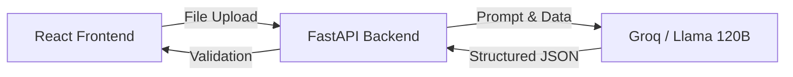

<div align="center">
  <h1>🧠 Sentiment Analyzer</h1>
  <p><strong>Agentic Conversation Intelligence Dashboard</strong></p>
  
  
  
  
  
</div>

<br />

## ℹ️ About
This project was developed to demonstrate the ability to seamlessly integrate modern frontend frameworks (React/Vite) with robust Python backends (FastAPI), while leveraging state-of-the-art Large Language Models (LLMs) to perform complex natural language processing tasks in real-time. The core philosophy of this project is **Clean Architecture**—ensuring strict separation of concerns, secure credential management, and predictable, strongly-typed data structures via Pydantic.

## 🌟 Overview
**Sentiment Analyzer** is a production-ready, full-stack AI application designed to intelligently analyze customer service phone conversations. By utilizing state-of-the-art LLMs, it extracts deep insights from standard text transcripts and visualizes them on a modern glassmorphism dashboard.

### ✨ Key Features
- **📊 Real-time Sentiment Visuals:** Dynamic Pie Charts mapping the exact distribution of positive, negative, and neutral sentences.
- **⚡ AI Confidence Scoring:** Evaluates the AI's certainty for every single extracted data point.
- **🎯 Smart Action Items:** Automatically extracts commitments and next steps from the dialogue.
- **🎭 Emotion Detection:** Tags the primary emotional states of the speakers (e.g., *frustrated, relieved, grateful*).
- **📈 Advanced KPIs:** Grades the conversation on Escalation Risk, Agent Helpfulness, and Resolution Likelihood.

---

## 🏗️ Architecture


* **Frontend:** React + Vite + Tailwind CSS + Recharts
* **Backend:** Python + FastAPI + Pydantic
* **AI Orchestration:** Dynamic fallback to Groq (`openai/gpt-oss-120b`) for lightning-fast strict JSON output.

---

## 🚀 Quick Start (Local Development)

### 1. Configure the AI
Create a `.env` file inside the `/backend` folder and add your API key:
```env
GROQ_API_KEY=your_api_key_here
```

### 2. Run the Application
For Windows users, simply double-click the included `run.bat` file to automatically launch both the backend and frontend simultaneously!

Alternatively, you can run them manually:
```bash
# Terminal 1: Backend
cd backend
pip install -r requirements.txt
uvicorn main:app --reload

# Terminal 2: Frontend
cd frontend
npm install
npm run dev
```

---

<div align="center">
  <i>Built for next-generation conversation intelligence.</i>
</div>
